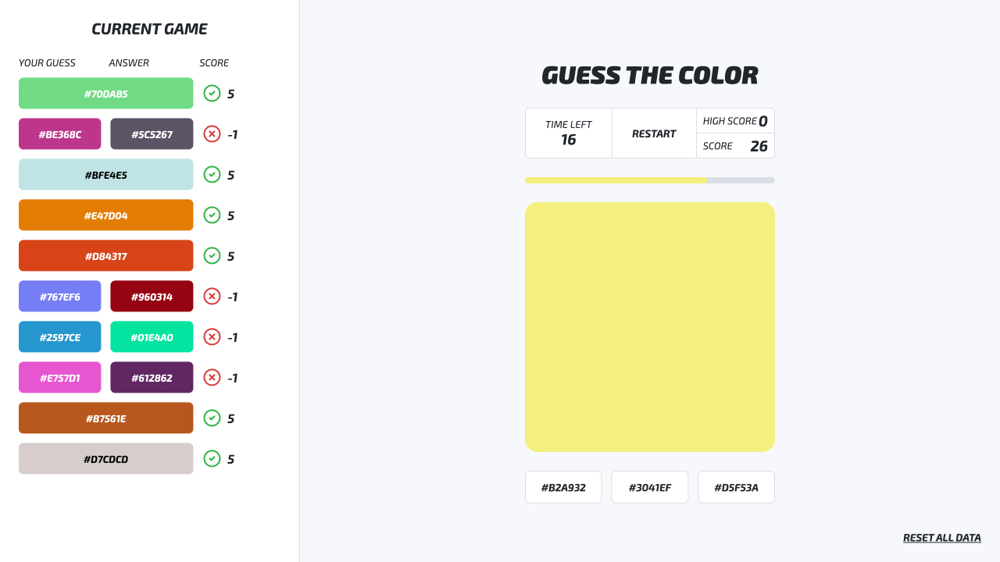

# Guess the Color 🎨

Desafio Frontend Analytics — advinhe o código HEX das cores!

## Como o jogo funciona?

O jogo consiste em acertar o máximo possível de cores em 30s. Quando o jogo inicia, uma cor aleatória irá aparecer e com ela 3 opções de resposta em hexadecimal, sendo duas incorretas (geradas aleatoriamente), e uma correta.

A cada rodada, uma nova cor aparece, e a pessoa terá ~~10s~~ para responder e resultar em ganho ou perda de pontuação:

- Se a pessoa responder a tempo, ganhará 5 pontos.
- Se a pessoa responder a tempo, mas errado, perderá 1 ponto.
- Se a pessoa não responder a tempo, ~~ela perde 2 pontos~~ o jogo acaba.

## Requisitos

- [x] O jogo só começa quando a pessoa decidir
- [x] Caso a pessoa atualize, ou feche a página:
  - [x] High score persiste
  - [x] Se um jogo estiver em andamento, volta-se ao estado inicial
  - [x] Pilha referente a última partida concluída persiste
- [x] Se a pessoa quiser, ela pode reiniciar a partida a qualquer momento
- [x] Se a pessoa quiser, ela pode limpar todos os dados salvos

## Observações

- O Redux está sendo usado para gerenciar o estado do jogo
- Para gerenciar a persistência, eu _pensei_ em usar [`redux-persist`](https://npmjs.com/package/redux-persist) ou [`lowdb`](https://npmjs.com/package/lowdb). Pela simplicidade do caso, decidi gerenciar o Local Storage manualmente dentro do Redux.
- Lendo o desafio, percebi uma inconsistência quanto ao tempo. Na [explicação original](https://github.com/gustavoittner/AnalyticsDesafioFront#como-o-jogo-funciona) de como o jogo funciona, entende-se que a pessoa tem 30 segundos para responder o máximo de cores possíveis e que ela tem 10 segundos para dar cada resposta, resultando em dois timers. O problema é que o protótipo apresenta apenas um único timer. Por isso, decidi seguir o protótipo e assumi que o `REMAINING TIME` representa o tempo restante do jogo, sem um tempo específico para cada resposta, que é o que faz mais sentido para mim, mas estou aberto à alterações nessa questão.
  - Por consequência, nenhum ponto é removido caso o tempo acabe. Seria estranho remover pontos quando o jogo acaba.
- De forma parecida, eu não pude deixar de notar que dar 5 pontos para cada acerto meio que quebra o jogo. Com três opções de resposta, fica viável chutar a resposta e ainda assim conseguir uma pontuação alta.
